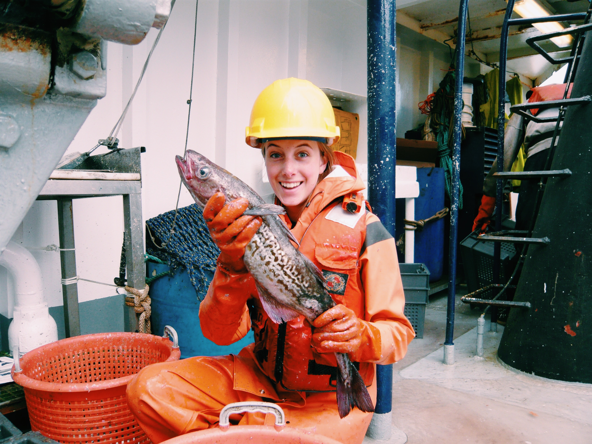

## About me 

Hi there, I'm Haley Oleynik! I'm currently a 2021 [NOAA Sea Grant Knauss Marine Policy Fellow](https://seagrant.noaa.gov/Knauss-Fellowship-Program) working with the [NOAA Fisheries Office of Science and Technology](https://www.fisheries.noaa.gov/about/office-science-and-technology) National Stock Assessment Program and a PhD student at the [University of British Columbia Institute for the Oceans and Fisheries](https://oceans.ubc.ca/).

My research interests include quantitative fish ecology, Bayesian fisheries assessment and modeling, and fisheries management evaluation. I received my BA in biology and sociology from [Colby College](https://www.colby.edu/) in 2015 and my MS in marine studies from the [College of Earth, Ocean, and the Environment](https://www.udel.edu/academics/colleges/ceoe/) at the University of Delaware. My undergraduate research focused on how environmental change influenced the social structure and dynamics of the lobster fishing industry in Maine. 

After graduating Colby I worked as a [North Pacific Groundfish Observer](https://www.fisheries.noaa.gov/alaska/fisheries-observers/north-pacific-observer-program) for the National Marine Fisheries Service where I lived on commercial pollock and rockfish fishing vessels in the Bering Sea and Gulf of Alaska and collected data on catch, bycatch, and fishing effort to support stock assessment science. 

My work in Alaska sparked my interest in fish population dynamics and lead me to pursue my Master's at the University of Delaware. My Master's research focused on fish community dynamics and associated environmental drivers in the Delaware Bay using a long-term, state run trawl survey.

